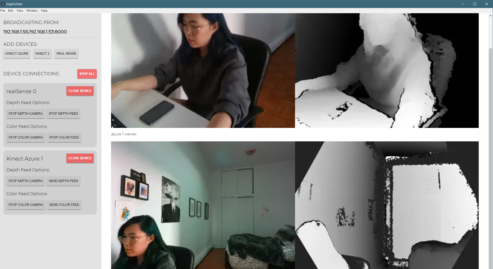

# Depth2Web

Depth2Web is an open source tool kit that connects multiple depth camera for the web. It is built as an Electron desktop application, and aims at being **device agnostic**, meaning that there will be less emphasis given to the individual body tracking tools themselves, and focuses on being the aggregating hub of various body tracking tools to provide uniform data for web-based use.



## Devices supported

* Microsoft Kinect Azure
* Microsoft Kinect V2
* Intel RealSense 2

## Client-side Library

Include:
```$xslt
<script src="https://cdn.jsdelivr.net/gh/js6450/depth2web/dist/depth2web-client.js"></script>
```

## Examples

* [Basic Example](https://github.com/js6450/depth2web/blob/master/examples/basic.html): Receiving feeds as `````` elements
* [Basic p5.js Example](https://editor.p5js.org/js6450/sketches/XqwcU-BBT): Instantiating with p5.js
* [p5.js Depth Ranging Example](https://editor.p5js.org/js6450/sketches/bMs20e8aM): Using pixel data with p5.js to draw 2D point cloud

## Contribution Guide

Depth2Web welcomes contribution to the tool kit in any form, including but not limited to, documentation, use case examples and code. Issues and pull requests are welcome!

## License

Depth2Web is released under MIT License. Please read the [license document](LICENSE.md) for more details.

## Technical Details

### Overview

Depth2Web is an Electron desktop application connects multiple depth cameras and packages them for feed for the web. The main Electron application script (index.js) connects the user interface renderer (app/app.js) via IPCMain and IPCRenderer API. When requested on the user interface renderer, new instances of devices are connected via the parent Device class which creates a device of the object of the requested type. Each of the supported device class contain node wrapper modules for the device's SDK. When a specific camera feed from the device is requested, IPCMain receives the feed from the Device objects as webp images and renders as an image on the renderer view. When localhost connection is started, either with a specified port number or not (with a default of 8080), socket.io web socket connection is opened and the image feeds shown on the renderer view is emitted to the localhost destination.

List of Dependencies:
* Electron
* Kinect V2 SDK
* Intel RealSense 2 SDK
* KinectV2 npm module
* Intel RealSense 2 npm module
* Socket.io npm module - for web socket connection between the application to a web client
* Sharp npm module - for rendering the images as webp image format
* MDL framework - for style of the user interface renderer of the application

### index.js: Electron Application Entry Point

Contains the Electron application object as well as the IPCMain object. Maintains an array of devices, which gets created when users request via the IPCRenderer. Communication midpoint between IPCRenderer and Device modules.

List of events:
* startDevice(type, id): Creates Device object of type with id. Pushes to the Devices array and starts the device pipeline. Watches onImage event from devices. Sends startedDevice event to IPCRenderer.
* startServer(port): Opens socket.io web socket localhost server with port with default of (8080). Sends startedServer event to IPCRenderer.
* closeDevice(id): Close connection of device id. Sends closedDevice event to IPCRenderer.
* closeServer: Close server connection. Sends closedServer event to IPCRenderer.

### renderer: Electron Application Renderer

Contains the Electron application renderer with HTML, CSS and application's IPCRenderer script that sends user's desired event to the IPCMain in index.js. Upon load, it initializes add device buttons with onclick events that send startDevice event to the IPCMain of the device type and id.

List of Events:
* startDevice(type, id): send event to IPC Main. 
* startedDevice(type, id): creates user interface panel for device of type and id that contains buttons for opening different camera feeds.
* startServer(port): send event to IPC Main with user's specified port number.
* startedServer: add localhost url with the assigned port number and changes button state from startServer to closeServer.
* image(device, img): receives and creates blo URL of received image file from IPCMain. Adds the created URL as source for designated image tag of the device.
* closeDevice(id): send closeDevice event of device of id.
* closeServer(): send closeServer event to IPCMain to close socket.io server connection
* close(): send close event to IPCMain to close all connected devices.
* closed(): prompts alert message when closedDevice and closedServer events are received from IPCMain.

### Device.js

Parent class of all device modules. Contains onColorFrame and onGrayFrame, which receive arrays of pixels from the device modules and using the Sharp node module, compresses and packages as webp images. Sends rendered image as onImage event.

#### RealSense.js

Contains node-librealsense npm module. When object is created, pipeline is started and polls for frames at the maximum framerate possible.

#### Kinect2.js

Contains KinectV2 npm module. Creates kinect connection and starts specified camera feed upon user request.

#### Azure.js

Contains Kinect Azure npm module. Creates kinect connection and starts specified camera feed upon user request.

### socketServer.js

Contains socket.io npm module. Starts the server when IPCRender sends IPCMain startServer event and emits to all connected sockets the onImage event data to localhost connection.
